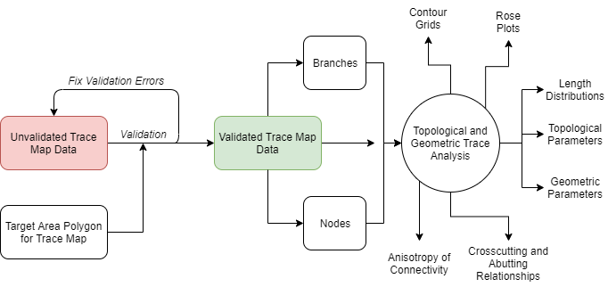

# Fractopo-2D

Fractopo-2D is a Python module that contains tools for validating and analysing
lineament and fracture trace maps (fracture networks).

## Development status

* In development.

## Full documentation

* Documentation hosted on Read the Docs:
  * [Documentation](https://fractopo.readthedocs.io/en/latest/index.html)

## Installation

### Pipenv

~~~bash
git clone https://github.com/nialov/fractopo --depth 1
cd fractopo
pipenv sync --dev
~~~

### Pip

The module is not on pypi currently. But pip can install from github.

~~~bash
pip install git+https://github.com/nialov/fractopo#egg=fractopo
~~~

## Usage

See [Notebooks with examples](https://tinyurl.com/yb4tj47e) for more advanced
usage guidance and examples.

### Geometric and topological trace network analysis

Trace and target area data (GeoDataFrames) are passed into a `Network` object
which has properties and functions for returning and visualizing different
parameters and attributes of trace data.

~~~python
from fractopo.analysis.network import Network
network = Network(
    trace_data, area_data, name="mynetwork", determine_branches_nodes=True,
)

# Properties are easily accessible
# e.g.
network.branch_counts
network.node_counts

# Plotting is done by plot_ methods
network.plot_trace_lengths()

~~~

### Trace validation

Trace and target area data can be validated for further analysis
with a `Validation` object.

~~~python
from fractopo.tval.trace_validation import Validation
validation = Validation(
    trace_data, area_data, name="mytraces", allow_fix=True,
)

# Validation is done with `run_validation` method
validated_trace_data = validation.run_validation()
~~~

Trace validation is also accessible as a console script, `tracevalidate`

Trace validation always requires the target area that delineates trace data.

~~~bash
# Get full up-to-date script help

tracevalidate --help

# Basic usage:
# --fix is recommended, probably won't work without it.
# --output can be omitted. By default the same spatial filetype
# as the input is used and the output is saved as e.g.
# /path/to/validated/trace_data_validated.shp
# i.e. a new folder is created (or used) for validated data
# --summary can be given to print out summary data of validation
# i.e. error types and error counts

tracevalidate /path/to/trace_data.shp /path/to/target_area.shp --fix --output /path/to/output_data.shp

# Or with automatic saving to validated/ directory

tracevalidate /path/to/trace_data.shp /path/to/target_area.shp --fix --summary
~~~
