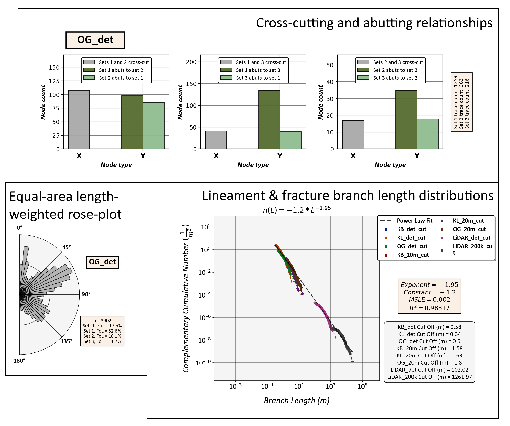

# Topological and geometric trace network analysis

## Description

This Python module can be used to extract lineament & fracture size,
abundance and topological parameters from two-dimensional lineament and
fracture trace, branch and node data. The results will be given as
graphical plots.

## Example plots

# Dependencies and References

## References

For the definition of traces, branches and nodes along with the
explanation of the plots and the plotted parameters, I refer you to
multiple sources.

* [Nyberg et al.,
  2018](https://pubs.geoscienceworld.org/gsa/geosphere/article/531129/networkgt-a-gis-tool-for-geometric-and-topological)
  * *NetworkGT Plugin introduction and guide.*
  * [NetworkGT GitHub](https://github.com/BjornNyberg/NetworkGT)

* [Sanderson and Nixon,
  2015](https://www.sciencedirect.com/science/article/pii/S0191814115000152)
  * *Trace and branch size, abundance and topological parameter definitions.*

* [My Master's Thesis, Ovaskainen,
  2020](http://urn.fi/URN:NBN:fi-fe202003259211)
  * *Plots used in my Thesis were done with an older version of the same code
    used for this plugin.*

* [Sanderson and Peacock,
  2020](https://www.sciencedirect.com/science/article/abs/pii/S001282521930594X)
  * *Information about rose plots.*

* [Alstott et al.
  2014](https://journals.plos.org/plosone/article?id=10.1371/journal.pone.0085777)
  * *Length distribution modelling using the Python 3 powerlaw package.*
  * [powerlaw GitHub](https://github.com/jeffalstott/powerlaw)

* [Bonnet et al.,
  2001](https://agupubs.onlinelibrary.wiley.com/doi/abs/10.1029/1999RG000074)
  * *Length distribution modelling.*
