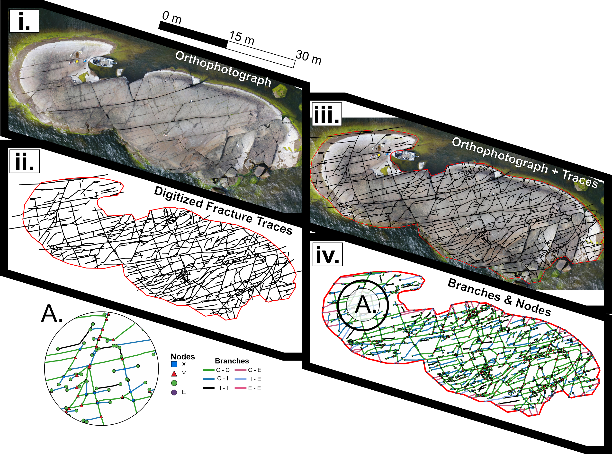

.. include:: ../README.rst

.. toctree::
   :hidden:
   :caption: Links

   Documentation (You Are Here) <self>
   Homepage (GitHub) <https://github.com/nialov/fractopo>
   Bug & Issue Reporting (GitHub) <https://github.com/nialov/fractopo/issues>

Full Documentation
==================

   Visualization of ``fractopo`` data. ``fractopo`` analyses the trace data
   that can e.g. be digitized from drone orthophotographs (fractures) or from
   digital elevation models (lineaments). The displayed branches and nodes are
   extracted with ``fractopo``.

Trace data must be validated using ``fractopo`` validation functionality before
analysis. The topological analysis of lineament & fracture traces implemented
in ``fractopo`` will not tolerate uncertainty related to the topological
abutting and snapping relationships between traces. Therefore the
trace validation is recommended before all analysis using ``Network``.

.. toctree::
   :maxdepth: 1
   :caption: Validating trace data

   validation/basics
   validation/errors
   notebooks/fractopo_validation_1
   notebooks/fractopo_validation_2

See above links for:

-  Basic trace data validation workflows
-  Examples of validation error types

For trace validation also see `above guide <#trace-validation>`__ on
``tracevalidate`` command-line tool.  After trace data validation, ``Network``
analysis can be conducted.

.. toctree::
   :maxdepth: 1
   :caption: Analyzing trace data

   analysis
   notebooks/fractopo_network_1
   auto_examples/index

See above links for:

-  Workflow of analyzing trace data with visualizations of geometric
   topological network characteristics.
-  Example scripts showcasing different analysis and plotting functionality
   implemented in fractopo.
-  `Notebook - Fractopo – KB11 Fracture Network
   Analysis <notebooks/fractopo_network_1.html>`__ is especially recommended.

.. toctree::
   :maxdepth: 1
   :caption: Module documentation (dev)

   apidoc/fractopo

