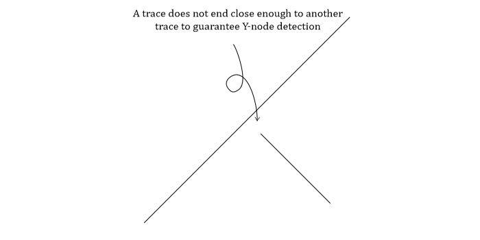

Validation errors
=================

The error string is put into the error column of the validated trace
data. Each error string is explained below. Possible automatic fixing is
indicated by the checkmarks:

No automatic fixing:

.. code:: markdown

   * [ ] Automatic fix

Some cases can be automatically fixed:

.. code:: markdown

   * [o] Automatic fix

All cases can be automatically fixed:

.. code:: markdown

   * [X] Automatic fix

This page additionally serves as a reminder on what interpretations to
avoid while digitizing traces. Most of the validation errors displayed
here cause issues in further analyses and should be fixed before
attempting to e.g. determine branches and nodes.

Only exception to the normal validation procedure is the check for empty
target areas (when target area is passed without any traces intersecting
it) and ``allow_empty_area`` is set to ``False`` (defaults to ``True``
i.e. no check).

In this case the error string is in all traces.

The empty area error string is:

.. code:: python

   "EMPTY TARGET AREA"

GeomTypeValidator
-----------------

The error string is:

.. code:: python

   "GEOM TYPE MULTILINESTRING"

The error is caused by the geometry type which is wrong:
``MultiLineString`` instead of ``LineString``.

``MultiLineString`` can consist of multiple ``LineStrings`` i.e. a
``MultiLineString`` can consist of disjointed traces. A ``LineString``
only consists of a single continuous trace.

-  [o] Automatic fix:

   -  Mergeable ``MultiLineStrings``
   -  ``MultiLineStrings`` with a single ``LineString``

Most of the time ``MultiLineStrings`` are created instead of ``LineStrings`` by
the GIS-software and the ``MultiLineStrings`` actually only consist of a
single ``LineString`` and conversion from a ``MultiLineString`` with a single
``LineString`` to a ``LineString`` can be done automatically. If the
``MultiLineString`` does consist of multiple ``LineStrings`` they can be
automatically merged if they are not disjointed i.e. the contained
``LineStrings`` join together into a single ``LineString``. If they cannot be
automatically merged no automatic fix is performed and the error is kept
in the error column and the user should fix the issue.

``MultiLineStrings`` are not accepted by ``fractopo`` as they cause 1. a
physical and 2. a technical inconsistency.

1.  A single fracture trace in ``fractopo`` is considered to be
    continuous and sublinear. A ``LineString`` fulfils this criteria
    better than a ``MultiLineString`` as they are always continuous.
2.  If ``MultiLineStrings`` and ``LineStrings`` are mixed in data, then
    it becomes inconsistent in if geometries are one or many in the rows
    of a ``geopandas.GeoDataFrame``.

MultiJunctionValidator
----------------------

The error string is:

.. code:: python

   "MULTI JUNCTION"

Three error types can occur in digitization resulting in this error
string:

1. More than two traces must not cross in the same point or **too
   close** to the same point.
2. An overlapping Y-node i.e. a trace overlaps the trace it “is
   supposed” to end at too much (alternatively detected by
   `UnderlappingSnapValidator <#underlappingsnapvalidator>`__).
3. `V NODE <#vnodevalidator>`__ errors might also be detected as
   ``MULTI JUNCTION`` errors.

.. figure:: ../imgs/MultiJunctionValidator.png
   :alt: Multi junction error examples.

   Multi junction error examples.

* [ ] Automatic fix

Fix the error manually by making sure neither of the above rules are
broken.

Motivation for this validation is primarily physical. An intersection
between three or more fractures is not defined as a separate topological
node as it is practically impossible for three-dimensional fracture
planes to have a common point. Consequently, there should never be an
intersection point between three fracture traces in nature and such
points are highlighted by this validation error. For the overlapping and
V-node errors see the respective error classes for motivation.

VNodeValidator
--------------

The error string is:

.. code:: python

   "V NODE"

Two traces end at the same point or close enough to be interpreted as
the same endpoint.

.. figure:: ../imgs/VNodeValidator.png
   :alt: V-node error examples.

   V-node error examples.

* [ ] Automatic fix

Fix by making sure two traces never end too near to each other.

V-nodes are not physically possible as it would require two fracture
planes to end along a single line and are not defined as a topological
node by `Sanderson and Nixon
(2015) <https://doi.org/10.1016/j.jsg.2015.01.005>`__.

MultipleCrosscutValidator
-------------------------

The error string is:

.. code:: python

   "MULTIPLE CROSSCUTS"

Two traces cross each other more than two times i.e. they have
geometrically more than two common coordinate points.

.. figure:: ../imgs/MultipleCrosscutValidator.png
   :alt: Multiple crosscut error examples.

   Multiple crosscut error examples.

* [ ] Automatic fix

Fix by decreasing the number of crosses to a maximum of two between two
traces.

Crosscuts between two traces more than two times more than likely
indicate either digitizing errors or e.g. topographical errors within a
raster where the traces have been digitized from. Due to topography, the
fracture plane intersections with the surface might appear curved even
though the plane itself might be subplanar.

However, it is probably possible for curved fracture surfaces to
crosscut each other more than two times in nature. However, this is
considered sufficiently rare that ``fractopo`` will not accept these as
valid fracture trace data. If such data needs to be analysed in the
future, the functionality can be considered to be added (post an issue
to ``fractopo`` GitHub!) and this validation error might be reworked.

UnderlappingSnapValidator
-------------------------

The error string is:

.. code:: python

   "UNDERLAPPING SNAP"

Or:

.. code:: python

   "OVERLAPPING SNAP"

Underlapping error can occur when a trace ends very close to another
trace but not near enough. The abutting might not be registered as a
Y-node.

Overlapping error can occur when a trace overlaps another only very
slightly resulting in a dangling end. Such dangling ends might not be
registered as Y-nodes and might cause spatial/topological analysis
problems later.

Overlapping snap might also be registered as a `MULTI
JUNCTION <#multijunctionvalidator>`__ error.

   Underlapping snap error examples.

   * [ ] Automatic fix

Fix by more accurately snapping the trace to the other trace.

The motivation for this validation error comes from two technical
problems:

1. Even though a trace abuts outside the snap threshold, and the
   abutment is not registered as a Y-node, the proximity can still cause
   errors in analysis during e.g. crosscutting and abutting relationship
   detection.
2. It is very unlikely, that abutments that occur slightly outside the
   snap threshold (the detected errors) are intentional. Rather, they
   often highlight errors during digitizing where an abutment has failed
   in the GIS-software used for digitizing.

Consequently, ``UnderlappingSnapValidator`` provides a safety buffer for
more accurate analysis of topological relationships.

TargetAreaSnapValidator
-----------------------

The error string is:

.. code:: python

   "TRACE UNDERLAPS TARGET AREA"

A trace ends very close to the edge of the target area but not close
enough. The abutting might not be registered as a E-node i.e. a trace
endpoint that ends at the target area. E-nodes indicate that the trace
length is undetermined.

.. figure:: ../imgs/TargetAreaSnapValidator.png
   :alt: Target area snap error examples.

   Target area snap error examples.

* [ ] Automatic fix

Fix by extending the trace over the target area. The analyses typically
crop the traces to the target area so there’s very little reason not to
always extend over the target area edge.

This technical error is expected to occur during faulty digitizing and
fixing these errors helps avoid inconsistent analysis regarding E-nodes.

GeomNullValidator
-----------------

The error string is:

.. code:: python

   "NULL GEOMETRY"

Rows with geometry set to None or equivalent type that is not a valid
GIS geometry or rows with empty geometries.

These rows could be automatically removed but these are most likely rare
occurrences and deleting the row would cause all attribute data
associated with the row to be consequently removed.

* [ ] Automatic fix

Fix by deleting the row or creating a geometry for the row. GIS software
can be fickle with these, make sure that if you create a new geometry it
gets associated to the row in question.

StackedTracesValidator
----------------------

The error string is:

.. code:: python

   "STACKED TRACES"

Two (or more) traces are stacked partially or completely on top of each
other. Also finds cases in which two traces form a very small triangle
intersection.

* [ ] Automatic fix

Fix by editing traces do that they do not stack or intersect in a way to
create small triangles.

Stacked traces are the result of faulty digitizing as two fractures
cannot co-exist along the same trace or that is at least the technical
and physical expectation in ``fractopo``.

SimpleGeometryValidator
-----------------------

The error string is:

.. code:: python

   "CUTS ITSELF"

A trace intersects itself.

.. figure:: ../imgs/SimpleGeometryValidator.png
   :alt: Trace intersects itself.

   Trace intersects itself.

* [ ] Automatic fix

Fix by removing self-intersections.

Fracture planes in nature should be subplanar and therefore unable to
cut themselves.

SharpCornerValidator
--------------------

The error string is:

.. code:: python

   "SHARP TURNS"

A lineament or fracture trace should not make erratic turns and the
trace should be sublinear. The exact limit on of what is erratic and
what is not is **open to interpretation and therefore the resulting
errors are subjective**. But if a segment of a trace has a direction
change of over 180 degrees compared to the previous there is probably no
natural way for a natural bedrock structure to do that.

``SHARP TURNS`` -errors rarely cause issues in further analyses.
Therefore fixing these issues is not critical.

.. figure:: ../imgs/SharpCornerValidator.png
   :alt: Erratic trace segment direction change examples.

   Erratic trace segment direction change examples.

* [ ] Automatic fix

Fix (if desired) by making less sharp turns and making sure the trace is
sublinear.
